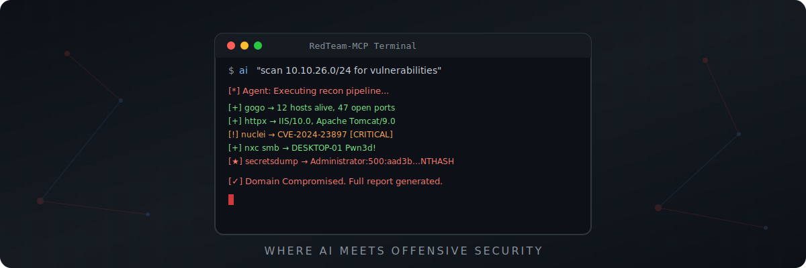

<div align="center">




# 🔴 RedTeam-MCP

### AI-Powered Autonomous Red Team Framework via Model Context Protocol

[](LICENSE)
[](https://python.org)
[](https://modelcontextprotocol.io)
[](/)
[](/)
[](https://github.com/ktol1/RedTeam-MCP)

**Let AI autonomously plan attack paths, invoke security tools, move laterally, and escalate domain privileges — like a real pentester.**

[English](#-overview) · [简体中文](#-概述) · [Quick Start](#-quick-start) · [Tools](#-integrated-tools) · [Architecture](#-architecture)

</div>

---

<!-- ═══════════════════════════════════════════════ -->
<!-- ENGLISH VERSION -->
<!-- ═══════════════════════════════════════════════ -->

## 📖 Overview

**RedTeam-MCP** is an AI red team automation framework built on the [Model Context Protocol (MCP)](https://modelcontextprotocol.io). It wraps **15+ mainstream offensive security tools** into standardized interfaces that any LLM can invoke directly.

With it, Claude / GPT / any MCP-compatible LLM can:

- 🔍 **Autonomous Asset Discovery** — Scan subnets, fingerprint OS, enumerate ports & services
- 🌐 **Web Fingerprinting** — Detect tech stacks, middleware, CMS versions
- 💥 **Precision Vulnerability Verification** — Template-based CVE/RCE/SQLi detection
- 🏰 **Active Directory Attacks** — Kerberoasting / AS-REP Roasting / DCSync / Delegation
- 🔀 **Lateral Movement** — Pass-the-Hash / WMI exec / SMB relay
- 📊 **Automated Reporting** — AI summarizes all findings into attack chain analysis

> **⚠️ Disclaimer**: This tool is for authorized security testing and educational purposes only. Always obtain proper authorization before testing.

---

## ✨ Key Features

<table>
<tr>
<td width="50%">

### 🤖 AI-Native Design
- All tools exposed via MCP Tool protocol, directly callable by AI
- Built-in timeout protection, output truncation, error recovery
- Non-interactive execution, no password prompt blocking

</td>
<td width="50%">

### ⚡ Zero-Config Setup
- One-click install script: binaries + Python packages auto-deployed
- No Nmap/Npcap driver dependencies
- **Windows & Linux** natively supported, works out of the box

</td>
</tr>
<tr>
<td width="50%">

### 🔧 15+ Integrated Tools
- Go high-performance engines: gogo / fscan / httpx / nuclei / ffuf / dnsx / kerbrute
- Python AD pentest suite: Impacket / NetExec (nxc) / BloodHound
- Playwright headless browser for JS-rendered page extraction
- Built-in native port scanner replacing Nmap

</td>
<td width="50%">

### 🧠 Agent Skill System
- Bundled `.github/skills/redteam/SKILL.md` knowledge base
- Guides AI on correct parameters & best practices per tool
- Progressive recon workflow: Discovery → Fingerprint → Exploit

</td>
</tr>
</table>

---

## 🚀 Quick Start

### Prerequisites

| Requirement | Windows | Linux |
|------------|---------|-------|
| OS | Windows 10/11 (x64) | Ubuntu 20.04+ / Kali / Debian (x64) |
| Runtime | Python 3.10+ | Python 3.10+ |
| Network | Internet (for tool download) | Internet (for tool download) |

### Step 1: Clone & Install

<details open>
<summary><b>🪟 Windows</b></summary>

```powershell
git clone https://github.com/ktol1/RedTeam-MCP.git
cd RedTeam-MCP/redteam-server

# Create virtual environment
python -m venv venv
venv\Scripts\activate.bat

# Install dependencies & download all tools
pip install -r requirements.txt
python install_tools.py
```
</details>

<details>
<summary><b>🐧 Linux</b></summary>

```bash
git clone https://github.com/ktol1/RedTeam-MCP.git
cd RedTeam-MCP/redteam-server

# Create virtual environment
python3 -m venv venv
source venv/bin/activate

# Install dependencies & download all tools
pip install -r requirements.txt
python3 install_tools_linux.py

# Make binaries executable
chmod +x ../redteam-tools/*
```
</details>

### Step 2: Add tools to PATH

<details open>
<summary><b>🪟 Windows</b></summary>

Add the `redteam-tools` directory to your system `PATH` environment variable.
</details>

<details>
<summary><b>🐧 Linux</b></summary>

```bash
# Add to ~/.bashrc or ~/.zshrc
echo 'export PATH="$HOME/RedTeam-MCP/redteam-tools:$PATH"' >> ~/.bashrc
source ~/.bashrc
```
</details>

### Step 3: Connect to AI Client

<details>
<summary><b>VS Code (Cline / Roo Code)</b></summary>

```json
{
  "mcpServers": {
    "RedTeam": {
      "command": "path/to/venv/Scripts/python.exe",
      "args": ["path/to/redteam-server/server.py"]
    }
  }
}
```
Linux: replace `Scripts/python.exe` with `bin/python3`
</details>

<details>
<summary><b>Claude Desktop</b></summary>

**Windows**: Edit `%APPDATA%\Claude\claude_desktop_config.json`  
**Linux**: Edit `~/.config/claude/claude_desktop_config.json`

```json
{
  "mcpServers": {
    "RedTeam": {
      "command": "path/to/venv/bin/python3",
      "args": ["path/to/redteam-server/server.py"]
    }
  }
}
```
</details>

<details>
<summary><b>Cursor IDE</b></summary>

Settings → Features → MCP Servers → Add:
- **Type**: `command`
- **Name**: `RedTeam`
- **Command**: `path/to/venv/bin/python3 path/to/redteam-server/server.py`
</details>

### Step 4: Test

```bash
# Start MCP Inspector
mcp dev server.py
```

Then tell your AI: *"Scan the 192.168.1.0/24 network for live Windows hosts and identify open services."*

---

## 🔧 Integrated Tools

| Category | Tool | Description |
|----------|------|-------------|
| 🔍 Asset Discovery | **[gogo](https://github.com/chainreactors/gogo)** | Ultra-fast port scanning & protocol fingerprinting |
| 🔍 Asset Discovery | **[fscan](https://github.com/shadow1ng/fscan)** | All-in-one intranet scanner (ports, vuln, brute-force) |
| 🌐 Web Recon | **[httpx](https://github.com/projectdiscovery/httpx)** | HTTP probing, tech detection, title extraction |
| 💥 Vuln Scanning | **[nuclei](https://github.com/projectdiscovery/nuclei)** | Template-based vulnerability scanner (CVE/RCE/SQLi) |
| 📂 Fuzzing | **[ffuf](https://github.com/ffuf/ffuf)** | Web directory & VHost brute-forcer |
| 🌍 DNS | **[dnsx](https://github.com/projectdiscovery/dnsx)** | DNS resolution & subdomain enumeration |
| 🔑 Kerberos | **[kerbrute](https://github.com/ropnop/kerbrute)** | Kerberos user enumeration & password spraying |
| 🏰 AD Attack | **[Impacket](https://github.com/fortra/impacket)** | wmiexec / psexec / secretsdump / getST / ntlmrelayx |
| 🔀 Lateral Movement | **[NetExec (nxc)](https://github.com/Pennyw0rth/NetExec)** | Multi-protocol pentest framework (SMB/WinRM/LDAP...) |
| 🗺️ AD Mapping | **[BloodHound.py](https://github.com/dirkjanm/BloodHound.py)** | Active Directory privilege path collection |
| 📡 Port Scan | **Built-in** | Native async Python port scanner (no Npcap needed) |
| 🌐 Browser | **[Playwright](https://playwright.dev)** | Headless browser for JS-rendered page info extraction |

---

## 🏗️ Architecture

```
┌─────────────────────────────────────────────────────────┐
│                   AI Agent (LLM)                        │
│            Claude / GPT / Any MCP Client                │
└──────────────────────┬──────────────────────────────────┘
                       │ MCP Protocol (stdio)
                       ▼
┌─────────────────────────────────────────────────────────┐
│               redteam-server/server.py                  │
│                  FastMCP Server                         │
│  ┌──────────┐ ┌──────────┐ ┌──────────┐ ┌───────────┐  │
│  │invoke_   │ │invoke_   │ │invoke_   │ │invoke_    │  │
│  │gogo()    │ │fscan()   │ │nuclei()  │ │dcsync()   │  │
│  └────┬─────┘ └────┬─────┘ └────┬─────┘ └─────┬─────┘  │
│       │  async subprocess + timeout protection  │       │
└───────┼─────────────┼───────────┼───────────────┼───────┘
        ▼             ▼           ▼               ▼
┌─────────────────────────────────────────────────────────┐
│                  redteam-tools/                          │
│   Windows: gogo.exe  fscan.exe  httpx.exe  nuclei.exe   │
│   Linux:   gogo     fscan     httpx     nuclei          │
│   + impacket-* / nxc / bloodhound-python (pip)          │
│   + playwright (headless Chromium browser engine)        │
└─────────────────────────────────────────────────────────┘
```

---

## 🎯 Demo

### Example: Autonomous Network Penetration

```
User: "Scan 10.10.26.0/24, find all Windows hosts, check for vulnerabilities."

AI Agent Execution Plan:
  1. gogo -i 10.10.26.0/24 -p win -v -q     → Found 4 Windows hosts
  2. httpx → Web services on :80, :8080       → Identified IIS, Tomcat
  3. nuclei -as -s critical,high              → CVE-2024-XXXX confirmed
  4. nxc smb ... --shares                     → Writable share found
  5. Report: Complete attack chain documented
```

### Example: Active Directory Attack Chain

```
User: "We have credentials user:pass for corp.local. Find a path to Domain Admin."

AI Agent:
  1. bloodhound-python -c All                → Collected AD graph
  2. kerbrute userenum                        → 47 valid users discovered
  3. GetUserSPNs.py (Kerberoast)             → 3 SPN hashes captured
  4. Cracked svc_backup hash → DA privileges via backup operator
  5. secretsdump.py -just-dc                  → Full domain hash dump
```

---

## 📁 Project Structure

```
RedTeam-MCP/
├── 📄 README.md                      # Bilingual docs (EN + 中文)
├── 📄 LICENSE                        # MIT License
├── 📂 assets/
│   ├── logo.svg                      # Project logo
│   └── banner.svg                    # Project banner
├── 📂 .github/skills/redteam/
│   └── 📄 SKILL.md                  # AI Agent knowledge base
├── 📂 redteam-server/
│   ├── 📄 server.py                 # MCP Server (all tool wrappers)
│   ├── 📄 install_tools.py          # Windows tool installer
│   ├── 📄 install_tools_linux.py    # Linux tool installer
│   ├── 📄 requirements.txt         # Python dependencies
│   └── 📄 README.md                # Server-specific docs
└── 📂 redteam-tools/                # Binary tools (auto-populated)
    ├── 🪟 *.exe                     # Windows binaries
    └── 🐧 * (no extension)          # Linux binaries
```

---

## 🤝 Contributing

Contributions are welcome! Please feel free to submit a Pull Request.

1. Fork the Project
2. Create your Feature Branch (`git checkout -b feature/AmazingFeature`)
3. Commit your Changes (`git commit -m 'Add some AmazingFeature'`)
4. Push to the Branch (`git push origin feature/AmazingFeature`)
5. Open a Pull Request

---

## 📜 License

Distributed under the MIT License. See [LICENSE](LICENSE) for more information.

---

<!-- ═══════════════════════════════════════════════ -->
<!-- 简体中文版本 -->
<!-- ═══════════════════════════════════════════════ -->

<div align="center">

# 🔴 简体中文文档

</div>

## 📖 概述

**RedTeam-MCP** 是一个基于 [Model Context Protocol (MCP)](https://modelcontextprotocol.io) 的 **AI 红队自动化框架**，将 15+ 款主流渗透测试工具封装为 AI 可直接调用的标准化接口。

通过它，Claude / GPT / 任何 MCP 兼容大模型能够：

- 🔍 **自主发现资产** — 扫描网段、识别操作系统、枚举端口与服务
- 🌐 **Web 指纹识别** — 探测技术栈、中间件、CMS 版本
- 💥 **漏洞精准验证** — 基于模板的 CVE/RCE/SQLi 检测
- 🏰 **域内攻击** — Kerberoasting / AS-REP Roasting / DCSync / 委派攻击
- 🔀 **横向移动** — Pass-the-Hash / WMI 执行 / SMB 中继
- 📊 **自动化报告** — AI 汇总所有发现并生成攻击链分析

> **⚠️ 免责声明**：本工具仅用于**授权的安全测试**和教育目的。使用前请务必获得合法授权。

---

## ✨ 核心特性

<table>
<tr>
<td width="50%">

### 🤖 AI 原生设计
- 所有工具通过 MCP Tool 协议暴露，AI 可直接调用
- 内置超时保护、输出截断、错误恢复机制
- 完全非交互式执行，无密码提示阻塞风险

</td>
<td width="50%">

### ⚡ 零配置安装
- 一键安装脚本：二进制工具 + Python 包全自动部署
- 无需 Nmap/Npcap 驱动依赖
- **Windows 与 Linux** 双平台原生支持，开箱即用

</td>
</tr>
<tr>
<td width="50%">

### 🔧 15+ 集成工具
- Go 高性能引擎：gogo / fscan / httpx / nuclei / ffuf / dnsx / kerbrute
- Python 域渗透套件：Impacket 全套 / NetExec (nxc) / BloodHound
- Playwright 无头浏览器动态页面信息提取
- 内置原生端口扫描器替代 Nmap

</td>
<td width="50%">

### 🧠 Agent 知识库系统
- 附带 `.github/skills/redteam/SKILL.md` 专家知识库
- 指导 AI 正确使用每个工具的参数和最佳实践
- 渐进式探测工作流：发现 → 指纹 → 漏洞验证

</td>
</tr>
</table>

---

## 🚀 快速开始

### 环境要求

| 要求 | Windows | Linux |
|------|---------|-------|
| 操作系统 | Windows 10/11 (x64) | Ubuntu 20.04+ / Kali / Debian (x64) |
| 运行时 | Python 3.10+ | Python 3.10+ |
| 网络 | 需要联网（下载工具）| 需要联网（下载工具）|

### 第一步：克隆并安装

<details open>
<summary><b>🪟 Windows 安装</b></summary>

```powershell
git clone https://github.com/ktol1/RedTeam-MCP.git
cd RedTeam-MCP\redteam-server

# 创建虚拟环境
python -m venv venv
venv\Scripts\activate.bat

# 安装依赖并一键下载所有工具
pip install -r requirements.txt
python install_tools.py
```
</details>

<details>
<summary><b>🐧 Linux 安装</b></summary>

```bash
git clone https://github.com/ktol1/RedTeam-MCP.git
cd RedTeam-MCP/redteam-server

# 创建虚拟环境
python3 -m venv venv
source venv/bin/activate

# 安装依赖并一键下载所有工具
pip install -r requirements.txt
python3 install_tools_linux.py

# 赋予执行权限
chmod +x ../redteam-tools/*
```
</details>

### 第二步：添加工具到 PATH

<details open>
<summary><b>🪟 Windows</b></summary>

将 `redteam-tools` 目录添加到系统的 `PATH` 环境变量中。
</details>

<details>
<summary><b>🐧 Linux</b></summary>

```bash
echo 'export PATH="$HOME/RedTeam-MCP/redteam-tools:$PATH"' >> ~/.bashrc
source ~/.bashrc
```
</details>

### 第三步：接入 AI 客户端

<details>
<summary><b>VS Code（通过 Cline / Roo Code 插件）</b></summary>

将以下配置加入 MCP Server 设置：

```json
{
  "mcpServers": {
    "RedTeam": {
      "command": "你的路径/venv/Scripts/python.exe",
      "args": ["你的路径/redteam-server/server.py"]
    }
  }
}
```
Linux 用户：将 `Scripts/python.exe` 替换为 `bin/python3`
</details>

<details>
<summary><b>Claude Desktop 桌面版</b></summary>

**Windows**：编辑 `%APPDATA%\Claude\claude_desktop_config.json`  
**Linux**：编辑 `~/.config/claude/claude_desktop_config.json`

```json
{
  "mcpServers": {
    "RedTeam": {
      "command": "你的路径/venv/bin/python3",
      "args": ["你的路径/redteam-server/server.py"]
    }
  }
}
```
</details>

<details>
<summary><b>Cursor IDE</b></summary>

设置 → Features → MCP Servers → 添加：
- **Type**: `command`
- **Name**: `RedTeam`
- **Command**: `你的路径/venv/bin/python3 你的路径/redteam-server/server.py`
</details>

### 第四步：测试

```bash
# 启动 MCP Inspector 调试模式
mcp dev server.py
```

然后对 AI 说：*"扫描 192.168.1.0/24 网段，发现所有 Windows 主机并识别开放服务。"*

---

## 🔧 集成工具列表

| 类别 | 工具 | 说明 |
|------|------|------|
| 🔍 资产发现 | **[gogo](https://github.com/chainreactors/gogo)** | 极速端口扫描与协议指纹识别 |
| 🔍 资产发现 | **[fscan](https://github.com/shadow1ng/fscan)** | 内网综合扫描器（端口/漏洞/弱口令爆破）|
| 🌐 Web 侦察 | **[httpx](https://github.com/projectdiscovery/httpx)** | HTTP 探测、技术栈指纹、标题提取 |
| 💥 漏洞扫描 | **[nuclei](https://github.com/projectdiscovery/nuclei)** | 基于模板的漏洞扫描器（CVE/RCE/SQLi）|
| 📂 模糊测试 | **[ffuf](https://github.com/ffuf/ffuf)** | Web 目录与虚拟主机爆破 |
| 🌍 DNS | **[dnsx](https://github.com/projectdiscovery/dnsx)** | DNS 解析与子域名枚举 |
| 🔑 Kerberos | **[kerbrute](https://github.com/ropnop/kerbrute)** | Kerberos 用户名枚举与密码喷洒 |
| 🏰 域攻击 | **[Impacket](https://github.com/fortra/impacket)** | wmiexec / psexec / secretsdump / getST / ntlmrelayx |
| 🔀 横向移动 | **[NetExec (nxc)](https://github.com/Pennyw0rth/NetExec)** | 多协议渗透框架（SMB/WinRM/LDAP...）|
| 🗺️ 域图谱 | **[BloodHound.py](https://github.com/dirkjanm/BloodHound.py)** | Active Directory 权限路径收集 |
| 📡 端口扫描 | **内置** | 原生异步 Python 端口扫描器（无需 Npcap）|
| 🌐 浏览器 | **[Playwright](https://playwright.dev)** | 无头浏览器动态页面信息读取（JS 渲染/Cookie/表单）|

---

## 🎯 演示

### 示例：自主网络渗透

```
用户："扫描 10.10.26.0/24，找到所有 Windows 主机，检查漏洞。"

AI Agent 执行计划：
  1. gogo -i 10.10.26.0/24 -p win -v -q     → 发现 4 台 Windows 主机
  2. httpx → :80, :8080 Web 服务              → 识别出 IIS、Tomcat
  3. nuclei -as -s critical,high              → 确认 CVE-2024-XXXX
  4. nxc smb ... --shares                     → 发现可写共享
  5. 报告：完整攻击链记录输出
```

### 示例：Active Directory 攻击链

```
用户："我们有 corp.local 的凭据 user:pass，找到通往域管的路径。"

AI Agent：
  1. bloodhound-python -c All                → 收集 AD 图谱
  2. kerbrute userenum                        → 发现 47 个有效用户
  3. GetUserSPNs.py (Kerberoast)             → 捕获 3 个 SPN 哈希
  4. 破解 svc_backup 哈希 → 通过备份操作员获取域管权限
  5. secretsdump.py -just-dc                  → 导出全域哈希
```

---

## ⭐ Star History

如果觉得这个项目有用，请给个 Star 支持一下！⭐

---

<div align="center">

**Built with ❤️ for the Security Community**

*RedTeam-MCP — Where AI Meets Offensive Security*

</div>
