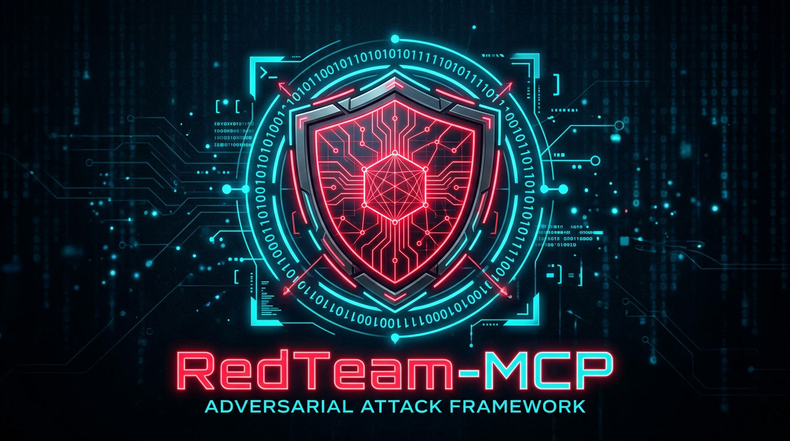

# RedTeam-Agent

<div align="center">



### AI 驱动的自动化红队渗透框架

**让 AI 直接化身安全审计黑客**

[](https://opensource.org/licenses/MIT)
[](https://www.python.org/)
[](./.github/skills/redteam/SKILL.md)
[](https://github.com/ktol1/RedTeam-Agent/stargazers)

[English](./README.md) · [中文](./README_zh.md) · [文档](./.github/skills/redteam/SKILL.md) · [快速开始](#-快速开始)

</div>

---

## 🎯 项目简介

RedTeam-Agent 是一个采用 **Skill-first 终端工作流** 的 AI 红队渗透测试框架。AI 读取项目 Skill 后，会自动识别工具并 能够自主执行内网渗透测试、活动目录攻击、漏洞利用等红队任务。

> **核心理念**：无需手动操作，AI 接管所有渗透工具，让安全测试真正自动化。

### ✨ 核心特性

| 特性 | 说明 |
|------|------|
| 🚀 **开箱即用** | 15+ 渗透工具自动安装，Windows 一键部署 |
| 🤖 **AI 驱动** | 通过 Skill + 终端，AI 直接调用渗透工具 |
| 💰 **Token 优化** | 智能输出压缩，节省 80% Token 消耗 |
| 🛡️ **域渗透完整** | BloodHound + impacket + Responder 全链路 |
| 🌐 **多客户端支持** | Cursor、Claude Desktop、VS Code Cline |

---

## 🛠️ 工具矩阵

### 网络扫描

| 工具 | 功能 | 场景 |
|------|------|------|
| [gogo](./.github/skills/redteam/SKILL.md#工具一gogo-极速资产与协议指纹探针) | 极速资产发现 | 内网主机探测 |
| [fscan](./.github/skills/redteam/SKILL.md#工具二fscan-内网综合扫描) | 综合扫描 | 端口/漏洞/弱口令 |

### Web 安全

| 工具 | 功能 | 场景 |
|------|------|------|
| [httpx](./.github/skills/redteam/SKILL.md#工具三httpx-web指纹与可用性探测) | Web 指纹识别 | 网站技术栈识别 |
| [nuclei](./.github/skills/redteam/SKILL.md#工具四nuclei-漏洞-poc-批量扫描) | POC 批量扫描 | 已知漏洞检测 |
| [ffuf](./.github/skills/redteam/SKILL.md#工具五ffuf-目录参数-fuzzing) | 目录 fuzzing | Web 目录爆破 |

### 活动目录攻击 🏆

| 工具 | 功能 | 场景 |
|------|------|------|
| [SharpHound](./.github/skills/redteam/SKILL.md#工具八sharphound-ad-权限图谱收集-windows) | Windows 收集器 | 域内数据采集 |
| [bloodhound-python](./.github/skills/redteam/SKILL.md#工具七-bloodhound-相关工具) | 跨平台收集器 | Linux/macOS 数据采集 |
| [GetNPUsers](./.github/skills/redteam/SKILL.md#impacket-getnpusersas-rep-roasting) | AS-REP Roast | 枚举不需要预认证的用户 |
| [GetUserSPNs](./.github/skills/redteam/SKILL.md#impacket-getuserspnskerberoasting) | Kerberoasting | 请求 SPN 票据破解 |
| [secretsdump](./.github/skills/redteam/SKILL.md#impacket-secretsdump-lsass-dump) | LSASS Dump | 提取明文和哈希 |
| [ntlmrelayx](./.github/skills/redteam/SKILL.md#impacket-ntlmrelayx) | NTLM Relay | 中继攻击 |
| [pywerview](./.github/skills/redteam/SKILL.md#工具九-powerview-域信息枚举) | 域信息枚举 | 用户/计算机/组 |
| [ldapdomaindump](./.github/skills/redteam/SKILL.md#工具十ldapdomaindump-ldap-域信息转储) | LDAP 转储 | 域信息快照 |

### 横向移动

| 工具 | 功能 | 场景 |
|------|------|------|
| [nxc](./.github/skills/redteam/SKILL.md#工具六netexec-nxc-内网横向渗透控制台) | NetExec | SMB/WinRM/SSH |
| [wmiexec](./.github/skills/redteam/SKILL.md#impacket-wmiexec) | WMI 执行 | 无文件横向 |
| [psexec](./.github/skills/redteam/SKILL.md#impacket-psexec) | PSEXEC | 服务执行 |

### 代理与凭据

| 工具 | 功能 | 场景 |
|------|------|------|
| [chisel](./.github/skills/redteam/SKILL.md#代理自动化搭建-proxy-setup) | HTTP 隧道 | 端口转发 |
| [responder](./.github/skills/redteam/SKILL.md#工具十一responder-llmnrntbns-欺骗) | LLMNR 欺骗 | 哈希收集 |

---

## 🚀 快速开始

### 1️⃣ 环境要求

```
Python 3.8+
Windows 10/11 或 Linux/macOS
8GB+ RAM (推荐)
```

### 2️⃣ 安装部署

```bash
# 克隆仓库
git clone https://github.com/ktol1/RedTeam-Agent.git
cd RedTeam-Agent/redteam-server

# 创建虚拟环境
python -m venv venv

# 激活虚拟环境
# Windows PowerShell
.\venv\Scripts\Activate.ps1
# Linux/macOS
source venv/bin/activate

# 安装依赖
pip install -r requirements.txt

# 下载二进制工具 (自动下载 gogo, fscan, httpx, nuclei 等)
python install_tools.py
```

### 3️⃣ 配置 MCP

#### Cursor IDE

打开 `设置` → `Features` → `MCP Servers` → `Add New Server`

```json
{
  "mcpServers": {
    "RedTeam-Agent": {
      "command": "D:\\RedTeam-Agent\\redteam-server\\venv\\Scripts\\python.exe",
      "args": ["D:\\RedTeam-Agent\\redteam-server\\server.py"]
    }
  }
}
```

#### Claude Desktop

编辑 `%APPDATA%\Claude\claude_desktop_config.json`:

```json
{
  "mcpServers": {
    "RedTeam-Agent": {
      "command": "D:\\RedTeam-Agent\\redteam-server\\venv\\Scripts\\python.exe",
      "args": ["D:\\RedTeam-Agent\\redteam-server\\server.py"]
    }
  }
}
```

### 4️⃣ 开始使用

对 AI 说：

```
🎯 扫描 192.168.1.0/24 网段，发现所有 Windows 主机并识别开放服务

🎯 使用 SharpHound 收集 corp.local 域信息，分析攻击路径

🎯 在 192.168.1.100 上搭建 chisel 代理，访问 10.10.10.0/24 网段

🎯 对 192.168.1.50 执行 Kerberoasting 攻击
```

---

## 📊 系统架构

```
┌─────────────────────────────────────────────────────────────────┐
│                                                                 │
│    ██████╗ ██████╗ ███████╗███╗   ███╗███████╗ ██████╗ ██╗    │
│    ██╔══██╗██╔══██╗██╔════╝████╗ ████║██╔════╝██╔═══██╗██║    │
│    ██████╔╝██████╔╝███████╗██╔████╔██║█████╗  ██║   ██║██║    │
│    ██╔═══╝ ██╔══██╗╚════██║██║╚██╔╝██║██╔══╝  ██║   ██║╚═╝    │
│    ██║     ██║  ██║███████║██║ ╚═╝ ██║███████╗╚██████╔╝██╗    │
│    ╚═╝     ╚═╝  ╚═╝╚══════╝╚═╝     ╚═╝╚══════╝ ╚═════╝ ╚═╝    │
│                                                                 │
│                    Model Context Protocol                        │
│                                                                 │
└─────────────────────────────┬───────────────────────────────────┘
                              │
              ┌───────────────┼───────────────┐
              │               │               │
              ▼               ▼               ▼
       ┌──────────┐   ┌──────────┐   ┌──────────┐
       │  Cursor   │   │  Claude  │   │  Cline   │
       │    IDE    │   │  Desktop │   │ (VS Code)│
       └──────────┘   └──────────┘   └──────────┘
              │               │               │
              └───────────────┼───────────────┘
                              │
              ┌───────────────┴───────────────┐
              │                               │
              ▼                               ▼
    ┌─────────────────────┐       ┌─────────────────────┐
    │   MCP Server (Python)│       │   MCP Server (Node)│
    │                     │       │                     │
    │  ┌───────────────┐  │       │  ┌───────────────┐  │
    │  │   server.py   │  │       │  │ @playwright/mcp│  │
    │  │               │  │       │  │               │  │
    │  │ 17+ Tools     │  │       │  │ Browser       │  │
    │  │ Output Opt    │  │       │  │ Automation    │  │
    │  └───────────────┘  │       │  └───────────────┘  │
    └─────────────────────┘       └─────────────────────┘
              │
              ▼
    ┌─────────────────────────────────────────────────────────────┐
    │                     Tool Layer                              │
    │  ┌────────┐ ┌────────┐ ┌────────┐ ┌────────┐ ┌────────┐  │
    │  │  gogo  │ │  fscan  │ │  httpx  │ │ nuclei  │ │ Sharp  │  │
    │  └────────┘ └────────┘ └────────┘ └────────┘ │Hound.exe│  │
    │  ┌────────┐ ┌────────┐ ┌────────┐ ┌────────┐ └────────┘  │
    │  │ nxc    │ │ chisel  │ │impacket │ │responder│            │
    │  └────────┘ └────────┘ └────────┘ └────────┘               │
    └─────────────────────────────────────────────────────────────┘
```

---

## 🎯 AD 攻击链路

```
     ┌─────────────────────────────────────────────────────────────────┐
     │                      攻击阶段流程图                              │
     └─────────────────────────────────────────────────────────────────┘

  ┌───────────────┐      ┌───────────────┐      ┌───────────────┐
  │    侦察阶段    │ ───► │    收集阶段    │ ───► │    分析阶段    │
  └───────────────┘      └───────────────┘      └───────┬───────┘
         │                                               │
         ▼                                               ▼
  ┌───────────────┐                            ┌───────────────┐
  │ gogo/fscan    │                            │ BloodHound GUI│
  │ kerbrute      │                            │ attack_paths  │
  │ pywerview     │                            │ analysis.py  │
  └───────────────┘                            └───────────────┘
                                                        │
  ┌───────────────┐      ┌───────────────┐            │
  │    攻击阶段    │ ◄─── │    移动阶段    │ ◄─────────┘
  └───────────────┘      └───────────────┘
         │                       │
         ▼                       ▼
  ┌───────────────┐      ┌───────────────┐
  │ Kerberoast    │      │ nxc smb       │
  │ AS-REP Roast  │      │ wmiexec       │
  │ secretsdump   │      │ psexec        │
  │ ntlmrelayx    │      │ getST         │
  └───────────────┘      └───────────────┘
```

---

## 📦 MCP 工具清单

| # | 工具名称 | 功能 | 核心命令 |
|---|---------|------|---------|
| 1 | `invoke_gogo` | 极速资产探针 | `gogo -t 100 -iL hosts.txt` |
| 2 | `invoke_fscan` | 内网综合扫描 | `fscan -hf hosts.txt` |
| 3 | `invoke_httpx` | Web 指纹探测 | `httpx -l urls.txt -title` |
| 4 | `invoke_nuclei` | 漏洞 POC 扫描 | `nuclei -l urls.txt -t vulnerabilities/` |
| 5 | `invoke_ffuf` | 目录 fuzzing | `ffuf -w wordlist.txt -u URL/FUZZ` |
| 6 | `invoke_nxc` | 内网横向渗透 | `nxc smb 192.168.1.0/24 -u user -p pass` |
| 7 | `invoke_kerbrute` | Kerberos 用户枚举 | `kerbrute userenum -d domain users.txt` |
| 8 | `invoke_bloodhound_analysis` | BloodHound 分析 | 解析 JSON 生成攻击报告 |
| 9 | `invoke_powerview` | 域信息枚举 | `pywerview get-domain-user` |
| 10 | `invoke_ldapdomaindump` | LDAP 信息转储 | `ldapdomaindump ldap://dc` |
| 11 | `invoke_responder` | LLMNR 欺骗 | `responder -I eth0` |
| 12 | `invoke_proxy_setup` | 代理自动化搭建 | chisel/nc/powershell |
| 13 | `invoke_playwright` | 浏览器自动化 | 截图/表单/爬取 |
| 14 | `invoke_wmiexec` | WMI 执行 | impacket-wmiexec |
| 15 | `invoke_psexec` | PSEXEC | impacket-psexec |
| 16 | `invoke_secretsdump` | LSASS Dump | impacket-secretsdump |
| 17 | `invoke_ntlmrelayx` | NTLM Relay | impacket-ntlmrelayx |

---

## ⚡ Token 优化机制

| 优化项 | 说明 | 节省比例 |
|-------|------|---------|
| ANSI 去除 | 清除终端颜色代码 | ~15% |
| 空白压缩 | 合并多余空行 | ~10% |
| 输出截断 | 最大 8000 字符 | ~50% |
| 进度条过滤 | 移除进度条输出 | ~20% |
| **总计** | | **~80%** |

---

## 📚 完整文档

| 文档 | 说明 |
|------|------|
| [SKILL.md](./.github/skills/redteam/SKILL.md) | AI Agent 完整工具文档 |
| [redteam-server/README.md](./redteam-server/README.md) | 服务器部署指南 |

---

## 🤝 贡献

欢迎提交 Issue 和 Pull Request！

[](https://github.com/ktol1/RedTeam-Agent)
[](https://github.com/ktol1/RedTeam-Agent)

---

<div align="center">

**MIT License** · Copyright © 2024-2026 **ktol1**

**如果你觉得有用，给个 ⭐ Star 吧！**

</div>
